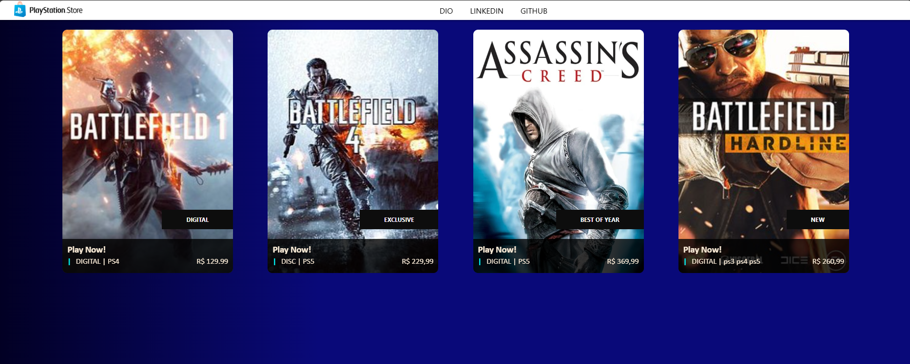

# Recriando a Interface da PlayStation Store com Angular

Desafio de projeto utilizando Angular: recriação do site da PlayStation Store, com estilização do menu e do conteúdo dos jogos, aplicando os conceitos de componentes, HTML5 e CSS.



## Criando a estrutura base do projeto

Criando da estrutura base de um projeto Angular utilizando o Angular CLI. O processo inicia com a pasta para o projeto, nomeada "angular-psn-store".

## **Estudo do Layout**

Construção do layout da interface da PlayStation Store para o desenvolvimento web, destacando a técnica de atomização de componentes. Criação de um card de jogo usando duas abordagens:

1. **Componente Único**: Englobando imagem, texto e preço
2. **Atomização**: Dividindo o card em componentes menores (imagem/link, texto descritivo, preço/informações adicionais).

## **Criando a base dos componentes**

Criação da base de componentes para um projeto Angular, começando pela criação da estrutura do projeto com uma pasta `pages` que contém um componente `home`.

O projeto utiliza dois componentes principais:

- **Card:** Para exibir informações em formato de cartão.
- **Menu Bar:** Uma barra de menu exibida em todas as páginas.

## **CSS Reset**

A utilização de um CSS reset para padronizar o estilo de elementos HTML, eliminando inconsistências entre navegadores. Criação de um arquivo CSS global (`Styles.css`) com regras de reset, como zerar margens, bordas e padding de elementos.

## **Gradiente background**

Criação de um fundo gradiente em CSS usando a ferramenta CSS Gradient.  Criando um fundo azulado para uma aplicação, explorando a possibilidade de gerar fundos lineares e radiais.

**Principais etapas:**

- Seleção de cores: Tons de azul, verde e rosa são escolhidos, mostrando a flexibilidade da ferramenta.
- Ajustes de inclinação e percentual: O vídeo ensina como controlar a inclinação e a porcentagem de cada cor, criando transições específicas.
- Integração ao código: O código CSS gerado é adicionado ao arquivo `Styles.css` dentro da pasta `src`, alterando o fundo da aplicação.
- Aplicação prática: O fundo gradiente é aplicado ao layout de uma loja virtual da Playstation.

Criação e implementação de fundos gradientes em CSS, com foco específico usando em tons de azul.

Link da ferramenta: https://cssgradient.io/

## **Estruturando uma página web**

Estruturação de uma página web com HTML e CSS, focando na criação de um menu e um container para cards. O processo é explicado passo a passo para um layout responsivo e visualmente agradável.

**Componentes Criados:**

- **`home__container`:** Centraliza os cards na página com margens laterais e espaçamento, usando `display: flex`, `flex-wrap`, e `justify-content: space-around`.
- **`menu-bar__container`:** Menu fixo na parte superior da tela (`position: fixed`) com `z-index: 999`, organizando o logo e os itens do menu com `display: flex` e fundo branco.
- **`menu-bar__logo`:** Div para o logo da aplicação.
- **`menu-bar__items`:** Div com uma lista não ordenada (`<ul>`) de links para DIO, LinkedIn e GitHub.

**CSS aplicados no site:**

- **Flexbox:** Alinhamento e distribuição flexíveis dos elementos.
- **`position: fixed` e `z-index`:** Posicionamento do menu e sobreposição de elementos.
- **Estilização CSS:** Controle de tamanho, margens, espaçamento, cores de fundo e outros aspectos visuais.

## **Menu parte 1**

Criação de menus, configurando um menu utilizando HTML e CSS, com foco na implementação visual do logo e disposição dos itens do menu.

**Principais etapas:**

1. Importação e posicionamento do logo da PlayStation Store.
2. Ajuste do tamanho da imagem e aplicação de margens.
3. Adição de uma leve sombra (`box-shadow`) abaixo do menu.
4. Centralização do logo e itens do menu usando `display: flex` e `align-items: center`.
5. Uso de `margin-left` e `margin-top` para espaçamento.

## Resolvendo o problema da imagem no navegador:

Eu estava com um problema na imagem com a tag `img`, que não aparecia a imagem no navegador, e resolvi esse problema ajustando a configuração no `angular.json`.

### Configuração do Angular.json
É importante verificar o arquivo angular.json, pois ele contém configurações sobre como os assets são tratados. Certifique-se de que a pasta assets e suas subpastas estejam corretamente listadas na seção assets. Por exemplo:

```json
"assets": [
  "src/favicon.ico",
  "src/assets"
],

```

## **Menu parte 2**

Estilizar um menu de navegação utilizando CSS, com foco na melhoria da aparência e organização dos itens do menu.

**Principais etapas:**

- **Manipulação da lista (`<ul>`):** Aplicação de `display: flex` para posicionar itens lado a lado, `text-decoration: none` para remover a decoração dos links, e `list-style-type: none` para remover marcadores.
- **Espaçamento entre itens (`<li>`):** Adição de `padding` e `margin-right` para criar espaçamento entre itens.
- **Estilização dos links (`<a>`):** Uso de `text-decoration`, `color`, `font-family`, `padding`, e `font-weight` para definir cor, fonte, espaçamento e peso da fonte.
- **Efeito hover:** Adição de efeito `hover` para mudar a cor e o peso da fonte dos links

## **Criando componentes a nível de átomo**

Criação de componentes de nível atômico em React, focando na organização em pastas e subcomponentes dentro de um componente maior, "Card". A ideia é evitar componentes isolados e promover uma estrutura mais organizada e reutilizável.

**Principais etapas:**

- Criação dos subcomponentes "CardLabel" e "CardPrice".
- Organização em pastas: `componentes/Card/CardLabel.tsx`, `componentes/Card/CardPrice.tsx`.
- Implementação básica do componente "Card", incluindo um link e uma imagem.
- Estilização (CSS) aplicada individualmente a cada subcomponente.

## **Estilizando o card component**

Estilização de um componente "Card" em CSS, focando na otimização e clareza do código. O processo é dividido em etapas:

1. **Estilização do container (`card__container`)**:
    - `position: relative`
    - `border`, `border-radius`
    - Largura e altura fixas (350px x 500px)
    - `overflow: hidden`
    - Margem superior
    - `display: flex` (configuração futura)
2. **Estilização da imagem (`card__image`)**:
    - `min-width` e `min-height` configurados para 100%
    - Efeito de transição `transform` com duração de 8 segundos para animação ao passar o mouse

A organização do código HTML é destacada como extremamente concisa, com a estilização separada e focada em responsabilidades específicas para cada componente (container, imagem, label e price). Criação e estilização dos componentes `Card Label` e `Card Price` em etapas subsequentes.

## **Criando o Card Label**

Criação de um componente "Label" em HTML e CSS, passo a passo. Inicialmente, a estrutura HTML é construída com divs aninhadas (`card-label`, `card-label__container`, `card-label__content`) para organizar o conteúdo, começando com o texto estático "Exclusive".

**Estilização CSS:**

- **Cores:** `background-color` (`#00000d`) e `color: white`.
- **Fonte:** `font-size: 12px`, `font-family: Segoe UI`, `font-weight: 100`.
- **Espaçamento:** `padding`.
- **Dimensões:** 40px de altura e 50px de padding lateral.

## **Criando o Card Pricing**

Criação de um componente "Card Pricing" em HTML e CSS, focando em organização e boas práticas de desenvolvimento. O processo é dividido em etapas:

1. **Estrutura HTML**: Criação de divs aninhadas para organizar os elementos, incluindo um container principal (`card-price__container`), um título (`card-price__title`), e o conteúdo de preços e plataformas (`card-price__value`).
2. **Estilização CSS**: Uso de `position: absolute` para o container principal, com ajustes de `width`, `height`, `background-color`, `bottom`, e `left`. Utilização de `display: flex` para alinhamento dos elementos, com `flex-direction: column` e `flex-direction: row`, além de `justify-content: space-between` para espaçamento. Aplicação de estilos adicionais como `font-weight: bold`, cor e margem.
3. **Passagem de Propriedades**:  Passar informações (`gameType`, `gamePrice`) do componente pai ("Card") para os componentes filho ("Card Label" e "Card Price") usando `@Input` no TypeScript, tornando o componente dinâmico e reutilizável.

## **Repassando parametros de componentes pais para filhos**

Passar parâmetros de componentes pais para filhos em Angular, utilizando a criação de cards de jogos. O objetivo é criar componentes reutilizáveis e independentes, facilitando a manutenção e evitando a repetição de código.

**Principais etapas:**

1. **Criar propriedades dinâmicas no componente pai:** Uma propriedade `gameCover` do tipo string é criada no componente `Card` para receber a imagem do jogo.
2. **Repassar propriedades do pai para os filhos:** As propriedades do componente `Card` são passadas para os componentes filhos (`CardLabel` e `CardPrice`) através de interpolação.
3. **Acesso às propriedades no componente HTML:** No componente `home`, as propriedades repassadas são usadas para exibir informações diferentes para cada card.

## **Refatoração**

A refatoração de código, focando na técnica de atomização de componentes para melhorar a organização e manutenibilidade dos projetos.  Dividindo um componente maior, como uma barra de menu, em subcomponentes menores, tornando o código mais limpo e modular.

**Aplicando técnicas de refatoração:**

- **Atomização:** Quebrar componentes grandes em unidades menores e específicas.
- **Organização CSS:** Manter o CSS específico para cada componente.
- **Angular CLI:** Uso da ferramenta `ng generate` para criar novos componentes.
- **Refatoração:** Reorganizar o código sem alterar sua funcionalidade.
- **Benefícios:** Código mais limpo, fácil de manter, modular e escalável.
